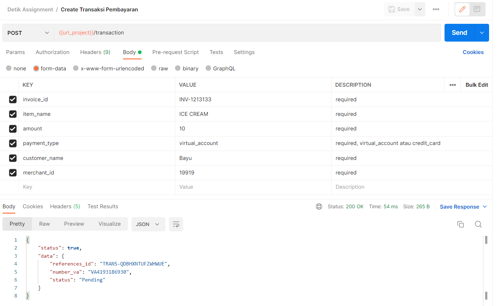
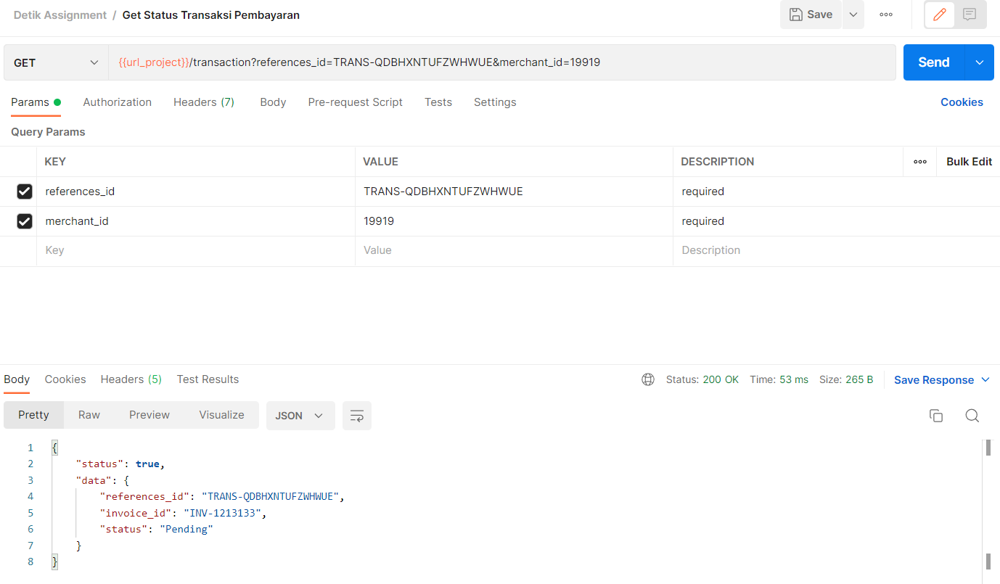

# Detik Payment Services
Submission aplikasi payment services sederhana

## Requirement
Untuk dapat menjalankan sistem ini, environtment yang dibutuhkan sebagai berikut :
1. PHP >= 7.2
2. PHP PDO extension (mysql/postgresql)

## Instalasi
Berikut adalah langkah instalasi dari sistem Detik Payment Services :
1. Download / clone project ini dan taruh di direktori yang diinginkan
```
https://github.com/bayuramadhans/detik-payment-services.git
```
2. Pada direktori project buka file `Databases/database.php` dan pada bagian 
pengaturan database atur config database sesuai dengan environtment masing-masing
```
// pengaturan database (sesuaikan dengan environment masing-masing)
private $host = "127.0.0.1";
private $db_type = "pgsql";
private $db_port = "5432";
private $db_name = "detik_payment";
private $username = "postgres";
private $password = "example_password";
```

3. Jalankan migration database dengan cara menjalankan command dibawah ini pada direktori project
```
php command.php migrate TransactionTable
```
jika migration berhasil, maka response berupa `Migration transactions telah berhasil`

4. Jika anda memerlukan data sample atau seeder, anda dapat menjalankan command dibawah ini pada direktori project
```
php command.php seed TransactionTable {jumlah}
```
jumlah data seeder opsional untuk di isi ( default 5 data )
5. Pada direktori utama project, buka command prompt dan jalankan command ini untuk memulai php server
```
php -S 127.0.0.1:8080
```
maka project ini dapat diakses dengan membuka `127.0.0.1:8080` pada browser
<br><br>
<b>Note</b> : <br>
Jika anda menggunakan in-build server seperti <b>xampp</b> atau <b>laragon</b>, maka pada langkah satu letakkan project ini di direktori main in-build server tersebut (contoh jika xampp maka diletakkan di folder htdocs yang ada di direktori xampp) lalu jalankan in-build server tersebut 

## API Endpoint
### Postman
Anda dapat melihat dokumentasi postman pada file `Examples/Detik Assignment.postman_collection`
### Dokumentasi
Berikut adalah API Endpoint yang tersedia dalam project ini :

#### 1. Create Transaksi Pembayaran
Digunakan untuk membuat record transaksi pembayaran baru
##### HTTP Request
```
POST {{url_project}}/transaction
```
##### Parameters

| Parameters    |Status         | Keterangan                        |
| ------------- |:-------------:| -------------                     |
| invoice_id    | required	  	| - |
| item_name     | required      | - |
| amount        | required      | - |
| payment_type  | required      | `virtual_account` atau `credit_card` |
| customer_name | required      | - |
| merchant_id   | required      | - |

##### Result

| Parameters    |  Keterangan  |
| ------------- |:--------------|
|status         | Bernilai `true` jika proses berhasil dan `false` jika proses terjadi kesalahan|
|message        | Pesan error ( hanya muncul ketika status `false` ) |
|data           | Data hasil proses create transaksi apabila status `true` dan berbentuk object dengan isi references_id, number_va, dan status|

##### Contoh


#### 2. Get Status Transaksi Pembayaran
Digunakan untuk mengambil status transaksi pembayaran
##### HTTP Request
```
GET {{url_project}}/transaction
```
##### Parameters

| Parameters    |Status         | Keterangan                        |
| ------------- |:-------------:| -------------                     |
| references_id | required	  	| Didapatkan ketika proses create sebuah transaksi |
| merchant_id   | required      | - |

##### Result

| Parameters    |  Keterangan  |
| ------------- |:--------------|
|status         | Bernilai `true` jika proses berhasil dan `false` jika proses terjadi kesalahan|
|message        | Pesan error ( hanya muncul ketika status `false` ) |
|data           | Data hasil proses create transaksi apabila status `true` dan berbentuk object dengan isi references_id, invoice_id, dan status|

##### Contoh


## Command
Berikut adalah command dari project ini yang berkaitan dengan transaksi :
### 1. Command merubah status transaksi
Anda dapat merubah status transaksi dengan menjalankan command php cli di direktori project ini sebagai berikut :
```
php command.php transactions change-status {references_id} {status}
```
#### Arguments

| Arguments    |Status         | Keterangan                        |
| ------------- |:-------------:| -------------                     |
| references_id | required	  	| Didapatkan ketika proses create sebuah transaksi |
| status   | required      | Status baru dari transaksi tersebut (Pending, Paid, atau Failed) |
